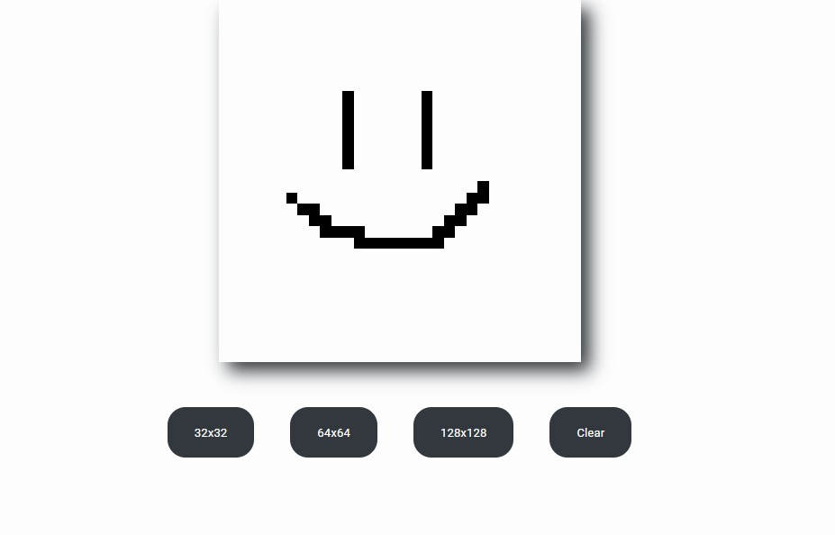

<h1 align="center"> Etch a Skecth </h1>

  <a href="#-tecnologias">Tecnologias</a>&nbsp;&nbsp;&nbsp;|&nbsp;&nbsp;&nbsp;
  <a href="#-projeto">Projeto</a>&nbsp;&nbsp;&nbsp;|&nbsp;&nbsp;&nbsp;

  

 

  

## 🚀 Tecnologias

Esse projeto foi desenvolvido com as seguintes tecnologias:

- HTML e CSS
- JavaScript

## 💻 Projeto

O projeto foi feito inspirado no brinquedo "Etch a Sketch" que consiste em um brinquedo de desenho. No site você pode escolher qual o tamanho do quadro para desenho, quanto mais pixels, mais detalhado, e um botão para apagar o desenho quando necessário.
